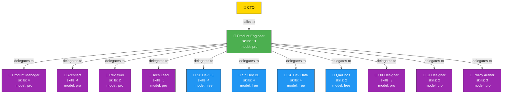
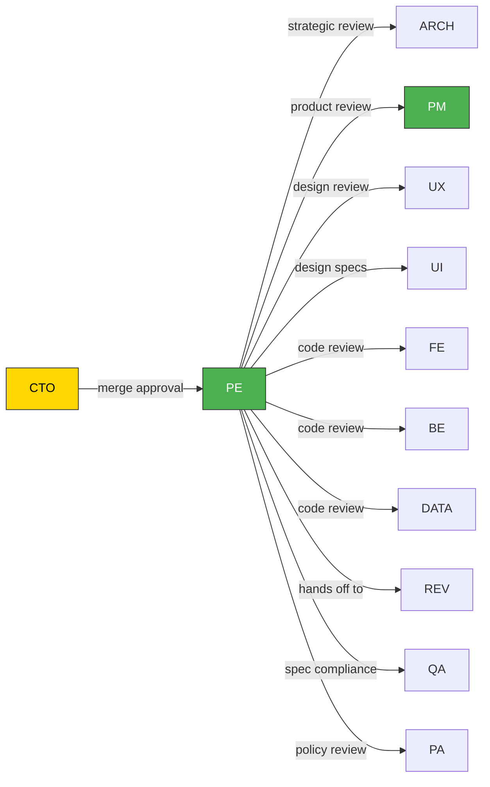
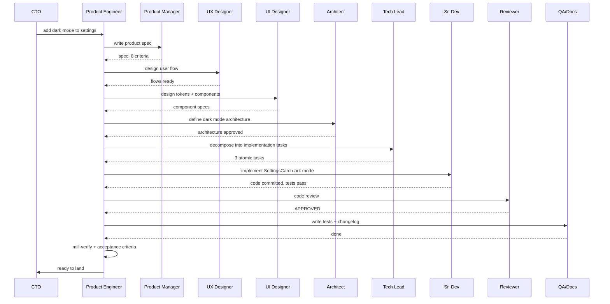

# Mill Org Chart — Delegation Hierarchy

## Who can delegate to whom

## What each arrow means

| From | To | Why |
|------|----|-----|
| CTO | Product Engineer | Technical direction |
| CTO | PM | Product decisions |
| Product Engineer | PM | Write product specs |
| Product Engineer | Architect | System architecture, ADRs |
| Product Engineer | Reviewer | Independent code review |
| Product Engineer | Tech Lead | Per-feature specs, task decomposition |
| Product Engineer | Sr. Dev BE/FE/Data | Implementation |
| Product Engineer | QA/Docs | Tests, changelog |
| Product Engineer | UX Designer | User flows, IA |
| Product Engineer | UI Designer | Components, tokens |
| Product Engineer | Policy Author | Policy maintenance (.mill/) |

## Who reviews whom

## Critical rules

| # | Rule | Why |
|---|------|-----|
| 1 | Only the Product Engineer delegates to all worker roles | Single dispatch point, no worker handoff |
| 2 | Every line of code passes through Tech Lead | Code review is Tech Lead's job |
| 3 | The Product Engineer never reviews code | The PE verifies process, not implementation |
| 4 | Architect handles cross-cutting decisions | Decisions before tactical work |
| 5 | Reviewer is independent second pair of eyes | Different from Tech Lead |
| 6 | Pro models decide, free models execute | The Product Engineer delegates. Sr. Devs implement. |

## Full pipeline: "Add dark mode"

## Model tiers

Each role declares its tier in its `ROLE.md` frontmatter (`model:` — either
`free→paid` or `pro`). Three tiers:

| Tier | Who uses it | Purpose |
|------|------------|---------|
| pro | Product Engineer, PM, Architect, Tech Lead, Reviewer, UX, UI, Policy Author | Decisions, review, design |
| free | Sr. Devs, QA/Docs | Execution, tests, documentation |

The tier resolves to an (agent, model) pair through `.mill/agents` — see
`.claude/skills/delegate/SKILL.md` section 2. Projects switch
providers by changing config, not roles or docs.
