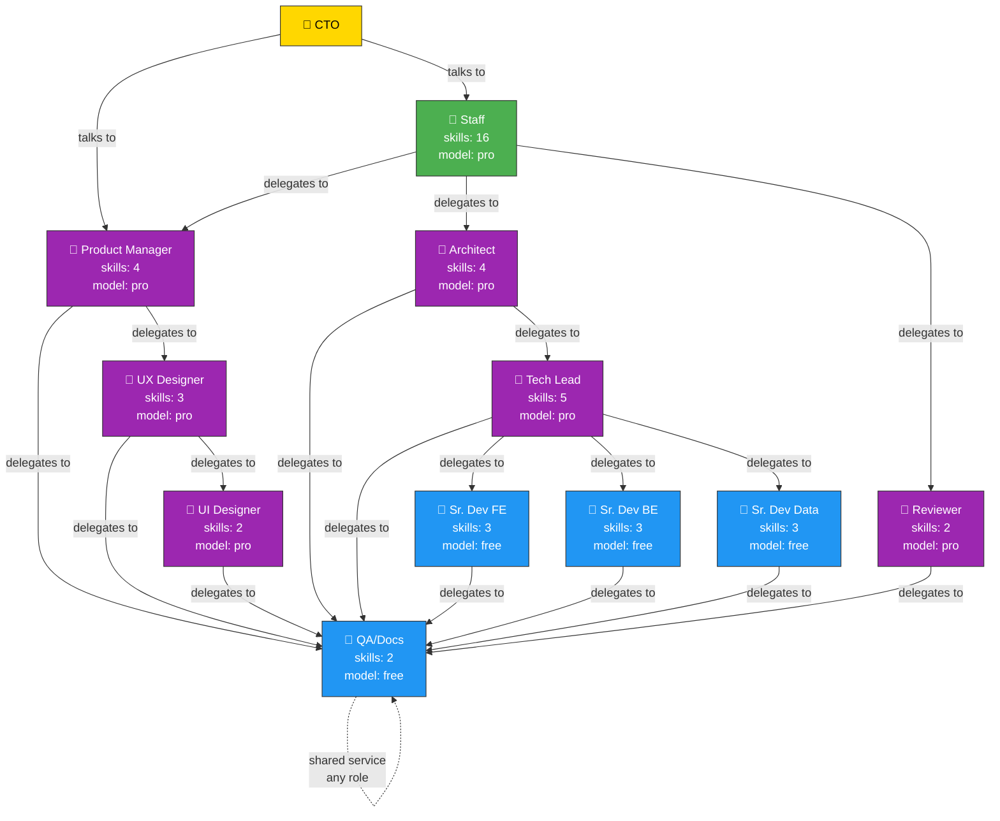
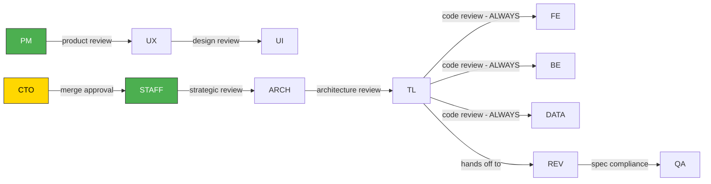
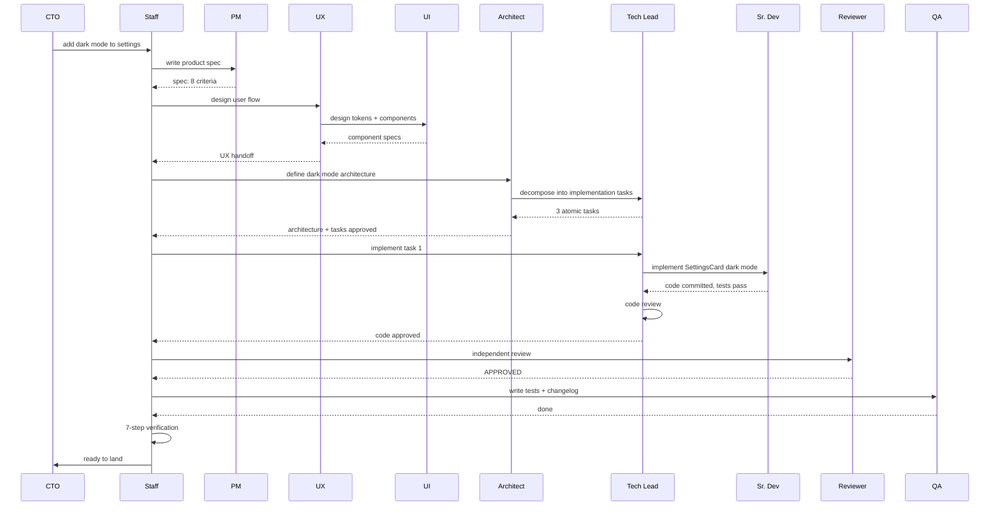

# Mill Org Chart — Delegation Hierarchy

## Who can delegate to whom

## What each arrow means

| From | To | Why |
|------|----|-----|
| CTO | Staff | Technical direction |
| CTO | PM | Product decisions |
| Staff | PM | Write product specs |
| Staff | Architect | System architecture, ADRs |
| Staff | Reviewer | Independent code review |
| PM | UX Designer | User flows, IA |
| UX | UI Designer | Components, tokens |
| Architect | Tech Lead | Per-feature specs, task decomposition, code review |
| Tech Lead | Sr. Dev FE/BE/Data | Implementation — THE ONLY ROLE that can |
| Tech Lead | QA/Docs | Tests, changelog |
| Reviewer | QA/Docs | Tests, docs |
| Anyone | QA/Docs | Shared service |

## Who reviews whom

## Critical rules

| # | Rule | Why |
|---|------|-----|
| 1 | Only Tech Lead delegates to Sr. Devs | Architect is strategic, Tech Lead is tactical |
| 2 | Every line of code passes through Tech Lead | Code review is Tech Lead's job |
| 3 | Staff never reviews code | Staff verifies process, not implementation |
| 4 | Architect sits between Staff and Tech Lead | Cross-cutting decisions before tactical work |
| 5 | Reviewer is independent second pair of eyes | Different from Tech Lead |
| 6 | Pro models decide, free models execute | Staff delegates. Sr. Devs implement. |

## Full pipeline: "Add dark mode"

## Model tiers

Models are configured in `mill.yml`, not hardcoded in docs or roles. Three tiers:

| Tier | Who uses it | Purpose |
|------|------------|---------|
| pro | Staff, PM, Architect, Tech Lead, Reviewer, UX, UI | Decisions, review, design |
| free | Sr. Devs, QA/Docs | Execution, tests, documentation |

The actual model mapping (e.g., `deepseek-v4-pro` for pro, `laguna-free` for free) lives in `mill.yml` per project. Projects switch providers by changing config, not roles or docs.
