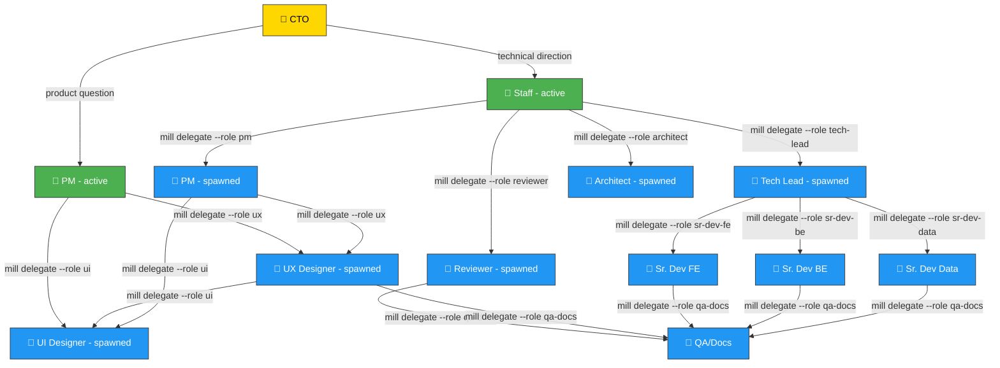
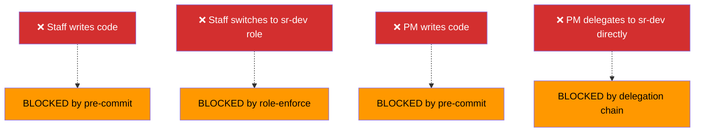
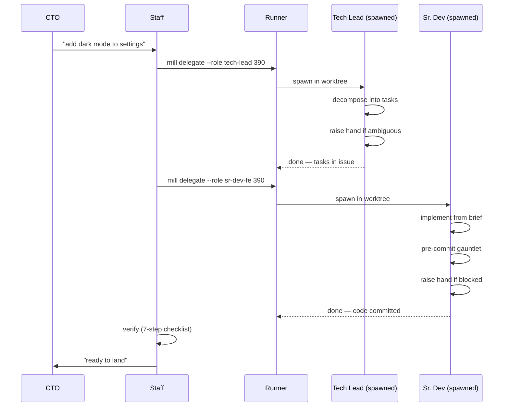

# Mill Architecture — Session Model

## Two active roles per session

Only Staff and PM can be the active role in a CTO session. They delegate everything using `mill delegate --role <target>`.

## What each active role can do directly

| Role | Can do directly | Must delegate |
|------|----------------|---------------|
| **Staff** | Talk to CTO, verify results, decide merge-readiness | Everything else: specs, design, implementation, review |
| **PM** | Talk to CTO, write product specs, prioritize | UX design, UI design, implementation |

## What NEVER happens

## Session lifecycle

## Key rules

1. **Staff and PM are the ONLY roles the CTO talks to directly.**
2. **Staff and PM NEVER execute work themselves** — they use `mill delegate --role <target>`.
3. **`mill delegate` validates the delegation chain.** Staff → Tech Lead ✅. Staff → Sr. Dev ❌.
4. **Spawned agents don't know who spawned them.** They know their role, their task, and their `reviewed_by` (from frontmatter).
5. **If a spawned agent has doubts → BLOCKED → escalation chain → resolved → resume.**
6. **The runner enforces everything mechanically.** Pre-commit hooks, delegation validation, classification.
