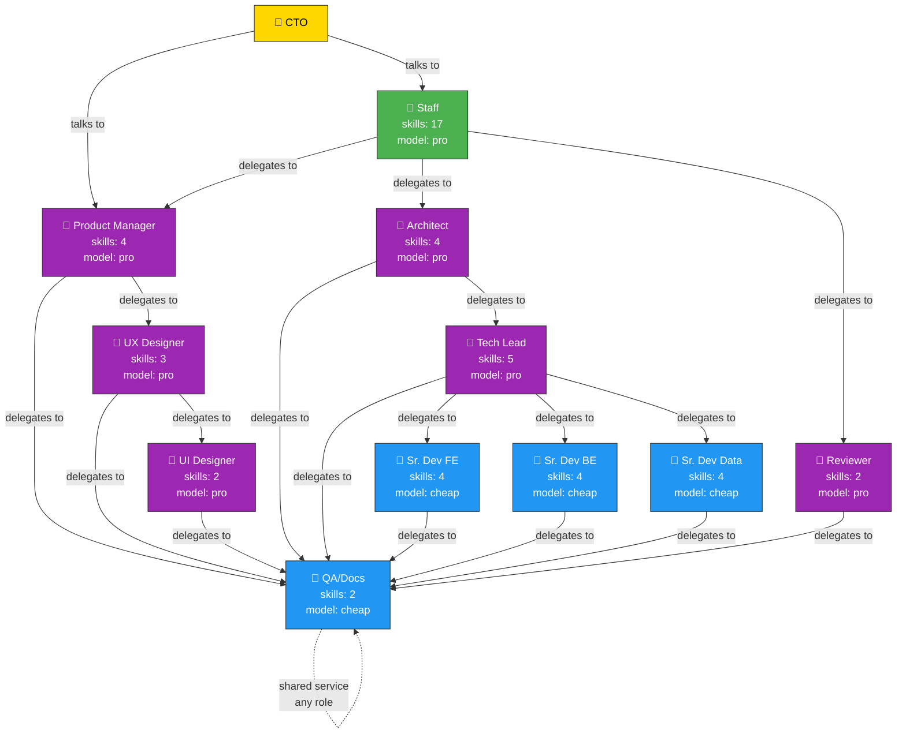
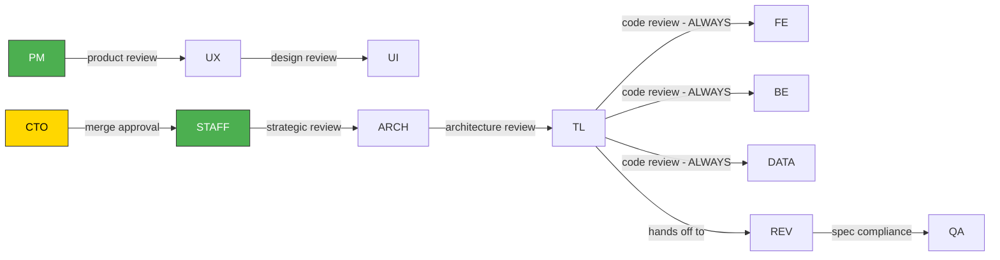
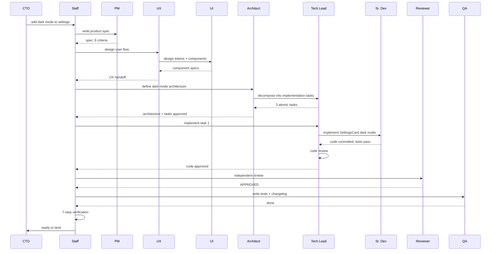

# Mill Org Chart — Delegation Hierarchy

## Who can delegate to whom

## What each arrow means

| From | To | Why |
|------|----|-----|
| CTO | Staff | Technical direction |
| CTO | PM | Product decisions |
| **Staff** | **PM** | Write product specs |
| **Staff** | **Architect** | System architecture, ADRs |
| **Staff** | **Reviewer** | Independent code review |
| PM | UX Designer | User flows, IA |
| UX | UI Designer | Components, tokens |
| **Architect** | **Tech Lead** | Per-feature specs, task decomposition |
| **Tech Lead** | **Sr. Dev FE/BE/Data** | Implementation (THE ONLY ROLE that can) |
| Tech Lead | QA/Docs | Tests, changelog |
| Reviewer | QA/Docs | Tests, docs |
| Anyone | QA/Docs | Shared service |

## Who reviews whom (review chain)

## Critical rules

| # | Rule | Why |
|---|------|-----|
| 1 | **Only Tech Lead delegates to Sr. Devs** | Architect is strategic, Tech Lead is tactical |
| 2 | **Every line of code passes through Tech Lead** | Code review is Tech Lead's job, not Staff's |
| 3 | **Staff never reviews code** | Staff is managerial — verifies process, not implementation |
| 4 | **Architect sits between Staff and Tech Lead** | Cross-cutting decisions before tactical decomposition |
| 5 | **Reviewer is independent** | Second pair of eyes, different from Tech Lead |
| 6 | **Expensive models (pro) never do cheap work** | Staff, PM, Architect delegate. Sr. Devs execute. |

## Full pipeline: "Add dark mode"

## What each role costs and why delegation matters

| Role | Model | Cost | Should NEVER |
|------|-------|------|-------------|
| Staff | deepseek-v4-pro | $0.36/session | Write code, review code, write specs |
| PM | deepseek-v4-pro | $0.36/session | Write code, design UI, touch architecture |
| Architect | deepseek-v4-pro | $0.36/session | Review individual PRs, implement |
| Tech Lead | deepseek-v4-pro | $0.36/session | Write production code |
| Reviewer | deepseek-v4-pro | $0.36/session | Fix code, design architecture |
| UX/UI | deepseek-v4-pro | $0.36/session | Write code |
| Sr. Devs | laguna-free | $0.00/session | Decide architecture, skip review |
| QA/Docs | laguna-free | $0.00/session | Decide scope, skip tests |

**Principle:** expensive model = decisions. Cheap model = execution. Staff is the most expensive — every token spent on implementation is waste.
