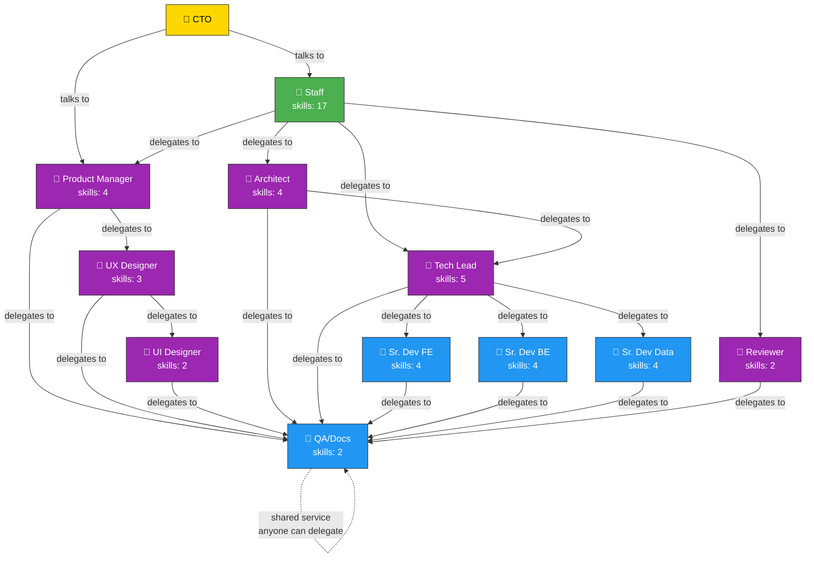
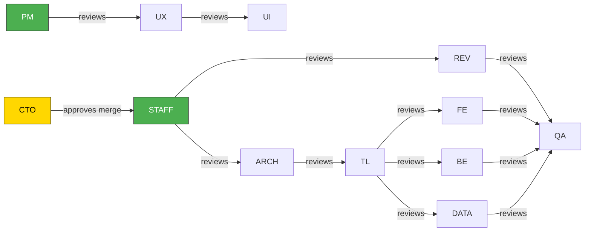
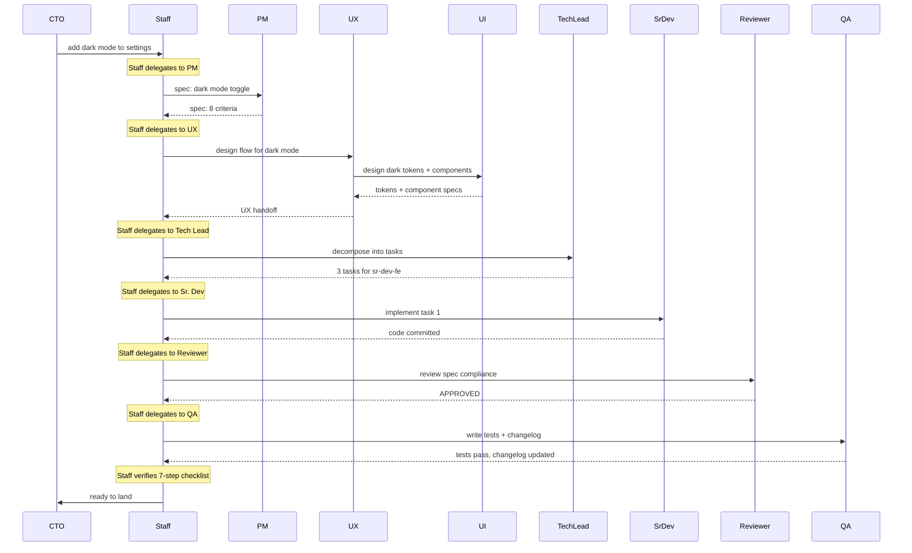

# Mill Org Chart — Delegation Hierarchy

## Who can delegate to whom

## What each arrow means

| From | To | Example |
|------|----|---------|
| CTO | Staff | "necesito dark mode" |
| CTO | PM | "cuál es la prioridad de X?" |
| Staff | PM | "escribime la spec de esto" |
| Staff | Tech Lead | "descomponé esta spec en tasks" |
| Staff | Reviewer | "revisá este PR" |
| PM | UX Designer | "diseñá el flujo de onboarding" |
| UX | UI Designer | "creá los componentes visuales" |
| Tech Lead | Sr. Dev FE | "implementá el componente X" |
| Tech Lead | Sr. Dev BE | "implementá el endpoint Y" |
| Cualquiera | QA/Docs | "escribime tests para esto" |

## What each role reviews

## Full pipeline example: "Add dark mode"

## Rules that CANNOT be broken (enforced mechanically)

| Rule | How enforced |
|------|-------------|
| Staff never writes Go code | pre-commit hook |
| PM never writes Go code | pre-commit hook |
| Staff never delegates to Sr. Dev directly | delegation validation in `mill delegate --role` |
| PM never delegates to Sr. Dev directly | delegation validation |
| No role can change `.mill/role` except to staff/pm | role-enforce hook |
| QA/Docs accepts delegation from anyone | no delegation validation for qa-docs |
