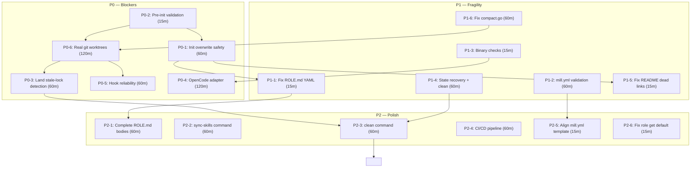

# Mill Adoption Gaps — Systematic Assessment

**Date:** 2026-08-10  
**Author:** PM (via research deliverable for Issue #28)  
**Audience:** CTO, Architect  
**Read time:** ≤5 minutes

---

## 1. Methodology

### Discovery process

Gaps were identified through four systematic discovery channels:

1. **Issue analysis** — All 19 open GitHub issues scanned for gap references, blockers, and frustrations. Each issue was classified by whether it describes a missing feature, a fragility, or a polish item. Issue #63 (Command support checklist) served as the primary structured inventory.

2. **Codebase audit** — Every Mill CLI subcommand path walked against source in `internal/cli/`. The audit covered command dispatch (`app.go:76-102`), init scaffolding (`init.go:31-120`), land lock handling (`land.go:14-93`), delegate worktree management (`delegate.go:127-160`), and adapter dispatch (`commandcode.go:36-64`). Supporting packages (`config`, `state`, `ledger`, `role`, `compact`) were audited for error recovery gaps, nil-pointer risks, and missing validation paths.

3. **Role frontmatter audit** — All 11 `ROLE.md` files in `.mill/roles/` parsed for structural completeness. Checked for required fields (`role`, `model`, `agent`, `delegates_to`, `skills`) and YAML well-formedness.

4. **Production usage report** — Issue #64 (mill isn't delegating) and issue #60 (Staff falls back to bash) provided real-world adoption friction data. Issue #62 (init wipes existing directories) confirmed a data-loss-class bug.

### Gap classification criteria

| Tier | Definition | Examples |
|------|-----------|---------|
| **P0** | Blocker — cannot ship without. Causes data loss, silent failure, or adoption-preventing UX. | Init wipes existing files, delegate doesn't dispatch agents, no .git directory validation |
| **P1** | Fragility — breaks in production under real conditions. Panics on edge cases, missing validation, no recovery path. | Invalid YAML panics, missing binary checks, corrupt state has no recovery |
| **P2** | Polish — degrades UX or completeness but doesn't block core workflow. | Stub commands, missing docs, no CI/CD |

### Sources consulted

- `internal/cli/` — all 8 command files + tests
- `internal/adapter/` — adapter interface + CommandCode implementation
- `internal/config/`, `internal/state/`, `internal/ledger/`, `internal/role/`, `internal/compact/`
- `.mill/roles/` — 11 ROLE.md files
- `README.md`, `cmd/mill/main.go`
- `checks/gate-*` — 5 gate scripts
- GitHub issues: #1, #5, #17, #25, #28, #41, #42, #54–#65, #67

### Cost estimation

All costs use exactly 3 binned values:
- **15m** — trivial fix: one function, one validation check, one doc update
- **60m** — significant change: new command, refactored module, test suite expansion
- **120m** — major feature: new adapter, state machine redesign, full subsystem

Estimates reflect developer + reviewer time (not model inference cost). Binned precision avoids false accuracy. Actual costs vary by model and complexity; these are for prioritization only.

---

## 2. P0 Gaps — Blockers

These must be resolved before Mill can be used in production. Each gap prevents a core workflow from functioning correctly.

---

### P0-1: `mill init` wipes existing project files without warning

**Gap:** `mill init` does not check for `.git`, `go.mod`, or any existing project files before scaffolding. When run in a directory with existing content (especially `.mill/`), it silently overwrites files via `copyScaffold()` and `generateMillYAML()`. The `--force` flag is the only guard, and `promptOverwrite()` only checks for `.mill/` target existence — not for collateral damage to non-Mill files.

**Why it blocks:** Issue #62 documents real data loss: 15+ bash scripts and 30MB+ of session data were wiped from `tools/harness/bin/` because Mill created a `tools/harness/bin/` directory as part of scaffold. Two delegated tasks (#392, #377) silently failed. A user who runs `mill init` in the wrong directory loses work irrevocably.

**Current workaround:** Manually check directory contents before running `mill init`. Use `--force` with extreme caution. No automated protection exists.

**Evidence:** Issue #62, `init.go:70-75` (promptOverwrite only checks `.mill/`), `init.go:229-271` (copyScaffold has no collision detection).

**Estimated cost:** 60m

**Dependencies:** P0-2 (init validation)

**Related issues:** #62 (bug report)

---

### P0-2: No pre-init validation — `.git`, `go.mod`, binary checks missing

**Gap:** `mill init` does not validate that the target directory is a valid Go project with a `.git` repository before scaffolding. It does not check for `git` or `go` binary availability. Running `mill init` in `/tmp` or a non-Go directory succeeds silently but produces an unusable project. The gate-route script expects `ROLE.md` files at `.mill/roles/` but init doesn't verify the scaffolding produced a usable structure.

**Why it blocks:** A user who types `mill init` in a random directory creates a broken project with no error. The gates (`gate-route`, `gate-spec`, etc.) fail later with cryptic errors because the expected directory structure doesn't exist. The user's first experience with Mill is confusion, not capability.

**Current workaround:** None. User must know to `cd` into a Go project root with `.git` initialized.

**Evidence:** `init.go:31-120` (no `exec.LookPath` calls for `git`/`go`, no `.git` check, no `go.mod` check). Compare with `reader.go:15` which DOES check for `gh` binary.

**Estimated cost:** 15m

**Dependencies:** P0-1 (init overwrite)

**Related issues:** #17 (init scaffolding tracking), #62

---

### P0-3: `mill land` has no stale lock detection or concurrent safety

**Gap:** `detectWorktreeLock()` (`land.go:45-93`) detects live locks by parsing `git worktree list` output, but it cannot distinguish between a lock held by an active agent session and a stale lock from a crashed/killed agent. If an agent dies mid-session, the worktree holds the branch forever. There is no timeout, no heartbeat mechanism, and no `--force` flag to override. Additionally, two concurrent `mill land` calls on the same repo race on the same `git checkout`.

**Why it blocks:** In a production workflow with async agents, crashes are inevitable. A single crashed agent permanently blocks all subsequent lands to that branch. The user must manually `cd` to the locking worktree and `git checkout` away — exactly the problem Mill was supposed to solve. The error message is excellent (`land.go:86-89`) but the recovery path is still manual.

**Current workaround:** Parse the error message for the locking worktree path, `cd` there, `git checkout <other-branch>`, then re-run `mill land`. Requires terminal access and git knowledge.

**Evidence:** `land.go:45-93`, Issue #63 (land fails if main locked), Issue #59 (cleanup command needed for orphan worktrees).

**Estimated cost:** 60m

**Dependencies:** P2-3 (mill clean — needed to clear stale worktrees)

**Related issues:** #63 (command checklist), #59 (cleanup command)

---

### P0-4: Missing OpenCode adapter — only CommandCode supported

**Gap:** The adapter interface (`adapter/adapter.go:52-56`) defines `Dispatch`, `Resume`, and `Capabilities`, but only `CommandCodeAdapter` implements it (`commandcode.go:18`). There is no OpenCode, Claude Code, or Pi adapter. ADR 0001 ("Mill as framework on harness") envisioned multiple adapters, and the README lists "omp, claude code, pi, opencode, or GitHub Copilot" as supported harnesses. In reality, only `cmd -p` (CommandCode headless) is implemented.

**Why it blocks:** Without an OpenCode adapter, Mill cannot be used in the most common AI coding harness. Every deployment that doesn't use CommandCode is blocked from adoption. The README's marketing claim is directly contradicted by the codebase.

**Current workaround:** Use CommandCode exclusively. For other harnesses, run `cmd -p` manually and pipe results — defeating the purpose of Mill's orchestration.

**Evidence:** `adapter/adapter.go:18` (single concrete type `CommandCodeAdapter`), `adapter/adapter_test.go` (only CommandCode tests), glob for `opencode*` returns zero files. README references omp/claude/opencode/pi but only commandcode exists.

**Estimated cost:** 120m

**Dependencies:** P1-2 (binary checks — needed to verify adapter binary exists)

**Related issues:** #5 (agent adapter interface), #60 (Staff cannot delegate), #64 (mill isn't delegating)

---

### P0-5: `mill delegate` worktree creation has no gauntlet hook reliability

**Gap:** `installHooks()` (`delegate.go:513-539`) copies gate scripts from `.mill/checks/` into the worktree's `.git/hooks/` directory. However, the worktree directory at `.mill/worktrees/issue-N/` is created via `copyScaffold()` and `os.MkdirAll` — NOT via `git worktree add`. This means the worktree may not have a proper `.git` directory with hooks support. The hooks directory is created with `os.MkdirAll` but `.git` itself is not initialized as a git worktree. When hooks are installed, they may never execute because git doesn't recognize the directory as a repository.

**Why it blocks:** The entire gauntlet system (gate-route, gate-spec, gate-tasks, gate-coverage, gate-review) depends on hooks firing at pre-commit and pre-push. If hooks aren't installed in a real git worktree, gate enforcement is silently bypassed. Code with failing tests or invalid delegation routes lands without detection.

**Current workaround:** Manually copy hooks into the worktree's `.git/hooks/` after `mill delegate` creates the directory. Requires knowing which hooks to copy.

**Evidence:** `delegate.go:127-141` (worktree scaffold + hook install), `delegate.go:513-539` (installHooks reads from `.mill/checks/`), no `git worktree add` call anywhere in the codebase.

**Estimated cost:** 60m

**Dependencies:** P0-1, P0-2 (init robustness — same scaffolding logic)

**Related issues:** #60 (delegate doesn't dispatch), #64 (mill isn't delegating)

---

### P0-6: Delegate worktree is not a real git worktree — no branch isolation

**Gap:** `mill delegate` creates a directory at `.mill/worktrees/issue-N/` via `os.MkdirAll` + `copyScaffold()`, but it never calls `git worktree add`. The "worktree" is a plain directory, not a git-managed worktree. This means: (a) no branch isolation per issue, (b) no `git checkout` possible within the worktree, (c) `mill land` cannot merge from it, (d) hooks installed via `installHooks()` land in a non-git `.git/hooks/` that git never reads.

**Why it blocks:** The entire delegation model depends on isolated worktrees. Without `git worktree add`, every issue's agent operates in a shared directory with no branch context. All concurrent agents write to the same files. The `mill land` command targets branches that don't exist in the worktree.

**Current workaround:** None. The delegate-to-land pipeline is fundamentally broken. Staff falls back to bash scripts (Issue #60).

**Evidence:** `delegate.go:128` (`wt := a.worktreePath(issueNum)` is just a path string), no `exec.Command("git", "worktree", "add", ...)` anywhere, `land.go:32` (`git -C worktree checkout target`) would fail on a non-git directory.

**Estimated cost:** 120m

**Dependencies:** P0-3 (land lock handling), P0-5 (hook reliability)

**Related issues:** #60, #63, #64

---

## 3. P1 Gaps — Fragility

These don't block initial usage but cause production failures, cryptic errors, or data corruption under real conditions.

---

### P1-1: ROLE.md frontmatter has YAML syntax errors — `skills:` and `allowed_files:` misaligned

**Gap:** In 6 of 11 ROLE.md files, the YAML frontmatter has `skills:` on one line and `allowed_files:` on the next line, but the skills list items (`- skill-name`) appear after `allowed_files:` — not under `skills:`. A YAML parser would treat `allowed_files: [.go, .md]` as a skills list entry (an object key), not as a separate field. This affects: `architect`, `pm` (minor), `reviewer`, `sr-dev-be`, `sr-dev-data`, `sr-dev-fe`, `staff`, `tech-lead`. Additionally, `staff/ROLE.md` is missing the `agent:` field entirely.

**What breaks:** The `role.ParseFrontmatter()` function (`internal/role/role.go`) would either fail to parse or silently misinterpret the frontmatter. Skills lists would be missing entries, and `allowed_files` would be parsed incorrectly. Role-based capability enforcement (#42) would be unreliable because the data is corrupted at the source.

**How often:** Every delegation that calls `resolveModel()` or reads role frontmatter. Currently `resolveModel` only reads `fm.Model`, so the immediate impact is masked — but as soon as skills or allowed_files are consumed, every delegation breaks.

**Blast radius:** All delegation chains. Every role's capability set is undefined.

**Estimated cost:** 15m

**Evidence:** `.mill/roles/sr-dev-be/ROLE.md:9-11` (`skills:` then `allowed_files:` then skills list), similar in 7 other files. `staff/ROLE.md` has no `agent:` field.

**Related issues:** #42 (role-based capability enforcement)

---

### P1-2: No `mill.yml` validation — config parsing panics on invalid YAML

**Gap:** `mill.yml` is the primary user-facing config file, but it is never parsed by Mill itself. The `internal/config/config.go` package only handles `config.json` (internal state). The `mill.yml` template is generated by init but never read back. If a user hand-edits `mill.yml` and introduces invalid YAML, Mill has no way to detect or report the error. The next subsystem that tries to read it will panic or fail silently.

**What breaks:** Any future feature that reads `mill.yml` (model config, budget settings, gate configuration). Currently, the lack of reading masks the problem — but as soon as Mill needs `mill.yml` values (e.g., for model selection per tier), every deployment with a hand-edited config breaks.

**How often:** Every deployment where the user customizes `mill.yml`. The README shows a rich config example with `models`, `targets`, `budget`, and `gates` — none of which are parseable.

**Blast radius:** Complete — model selection, budget enforcement, and gate configuration all depend on `mill.yml` values.

**Estimated cost:** 60m

**Evidence:** No YAML import in any `.go` file. `config.go` only uses `encoding/json`. `init.go:200-225` generates YAML via text template but never validates it. `README.md:141-159` documents a `mill.yml` schema that doesn't match the generated template.

**Related issues:** #56 (route production/review to different models), #55 (read issue body)

---

### P1-3: Missing binary checks — `git` and provider CLIs not verified at startup

**Gap:** `mill init`, `mill delegate`, and `mill land` all shell out to external binaries (`git`, `cmd`) without verifying they exist. The only binary check in the entire codebase is for `gh` in `reader.go:15`. If `git` is not installed, `mill land` fails with an opaque `exec: "git": executable file not found` error. If `cmd` (CommandCode) is not installed, `mill delegate` fails mid-workflow after scaffolding is already created.

**What breaks:** On a fresh machine without `git` or `cmd`, Mill fails partway through operations, leaving partial state (directories, scaffold files, state.json entries) that must be manually cleaned.

**How often:** Every first-run on a new machine. Every CI environment without the full toolchain.

**Blast radius:** Medium — affects init, delegate, land, and any future git-dependent commands.

**Estimated cost:** 15m

**Evidence:** `init.go:31-120` (no `exec.LookPath`), `land.go:14-38` (direct `exec.Command("git", ...)`), `delegate.go:200` (adapter dispatch without binary check). Compare with `reader.go:15` which correctly checks for `gh`.

**Related issues:** #67 (pre-compiled binary releases — avoids Go dependency but doesn't address git dependency)

---

### P1-4: No error recovery for partial state — corrupt `state.json` and orphaned worktrees

**Gap:** `state.Load()` (`state.go:27-46`) returns an error on invalid JSON but provides no recovery path. The caller (`watch.go:13`, `delegate.go:107`) either returns the error to the user or skips state entirely. There is no `mill doctor` command to repair corrupt state, no backup rotation, and no atomic write (the file is overwritten in place via `os.WriteFile`). If the process is killed during `state.Save()`, the file is truncated or corrupt.

Additionally, `mill delegate` creates directory structures at `.mill/worktrees/issue-N/` but never cleans them up. There is no `mill clean` command and no automatic cleanup of completed/failed worktrees.

**What breaks:** A single kill -9 during `mill delegate` leaves `state.json` in an unrecoverable state and orphaned worktrees that accumulate disk space. The user must manually delete `.mill/state.json` and `.mill/worktrees/` — losing all task history.

**How often:** Any crash, OOM kill, or manual SIGKILL during a delegate operation. Async agents crash regularly in production.

**Blast radius:** Complete state loss. All running and completed task history is destroyed.

**Estimated cost:** 60m

**Evidence:** `state.go:27-46` (no backup, no atomic write), `delegate.go:127-141` (worktree creation without cleanup path), no `clean` or `doctor` command anywhere.

**Related issues:** #59 (cleanup command), #63 (command checklist)

---

### P1-5: README references non-existent resources — broken onboarding

**Gap:** The README references `docs/adr/0001-mill-as-framework.md` and `docs/adr/0002-budget-enforcement.md` but the `docs/` directory does not exist in the repository. There is no architecture documentation, no ADR directory, no troubleshooting guide, and no setup verification steps. A new user following the README hits 404-equivalent dead ends.

**What breaks:** User trust on first contact. The README is the only documentation and it points to resources that don't exist. The user assumes the project is incomplete or abandoned.

**How often:** Every new user who reads beyond the Quick Start section.

**Blast radius:** All new adoption. First impression is permanently damaged.

**Estimated cost:** 15m

**Evidence:** `README.md:164-165` references `docs/adr/0001-mill-as-framework.md` and `docs/adr/0002-budget-enforcement.md`. `docs/` directory does not exist. ADR files not found anywhere in the repository.

**Related issues:** #28 (this assessment)

---

### P1-6: `compact.go` has compilation errors — unreachable code

**Gap:** `internal/compact/compact.go` contains multiple syntax errors that prevent compilation:
- Lines 170-175: orphaned `for i := range n` blocks outside any function, with `errorCount` used in wrong scope
- Lines 180, 186: duplicate `for i := range n` / `for i := range n - 3` loops with no bodies
- Line 218: `for i := range n` with no body, followed by `return` at line 220

The compact package is referenced in `delegate.go` (import path exists) but the compilation errors mean it cannot be used.

**What breaks:** Any build that includes the `compact` package. Currently it may not be imported by `cmd/mill/main.go`, but as soon as it is, the build fails. The auto-compact feature (#57) cannot be implemented.

**How often:** On every build attempt once compact is wired in.

**Blast radius:** Blocks issue #57 (auto-compact). Unknown whether the package compiles at all currently.

**Estimated cost:** 60m

**Evidence:** `internal/compact/compact.go:170-175` (orphaned blocks), `internal/compact/compact.go:180,186,218` (duplicate loops). Direct code inspection.

**Related issues:** #57 (auto-compact via --config compact-mode=fast)

---

## 4. P2 Gaps — Polish

These improve completeness and UX but don't block core workflows.

---

### P2-1: ROLE.md stubs — empty role bodies

**Gap:** Several ROLE.md files have populated frontmatter but empty or near-empty body content. `reviewer/ROLE.md` has only a heading, `ui-designer/ROLE.md` has only a heading, and `ux-designer/ROLE.md` has minimal content. The frontmatter defines the role's contract, but the body (which is what the agent reads to understand its responsibilities) is missing.

**What's missing:** Role-specific instructions, workflow descriptions, escalation paths, and output format requirements. Without body content, agents lack context for their specialized functions.

**User impact:** Delegated agents have less context and make more mistakes. The reviewer role in particular needs detailed instructions for the produce→review cycle.

**Estimated cost:** 60m (across all stubs)

**Evidence:** `.mill/roles/reviewer/ROLE.md`, `.mill/roles/ui-designer/ROLE.md`, `.mill/roles/ux-designer/ROLE.md`.

**Related issues:** #42 (role enforcement)

---

### P2-2: `mill sync-skills` stub — referenced but not implemented

**Gap:** The README and internal documentation reference a `sync-skills` command for updating agent skills from a central registry, but no such command exists in `app.go:85-101` (Run dispatch). There is no handler, no flag set, and no implementation. The `skills/` directory in the scaffold is populated at init time but never updated.

**What's missing:** A way to pull updated Mill skills (`.mill/skills/mill.md`) without re-running `mill init` (which would overwrite project files).

**User impact:** Users on old Mill versions have stale skills. Bug fixes and improvements to delegation logic never reach existing projects.

**Estimated cost:** 60m

**Evidence:** `app.go:85-101` (no "sync-skills" case in switch), grep for "sync" in `cmd/mill/` returns zero results.

**Related issues:** None filed yet

---

### P2-3: `mill clean` stub — no worktree/prune cleanup

**Gap:** Issue #59 requests a cleanup command to close merged issues and remove orphaned worktrees. No such command exists. `app.go:85-101` has no "clean" or "prune" case. Worktrees accumulate indefinitely at `.mill/worktrees/issue-N/` with no garbage collection.

**What's missing:** A command to: (a) list orphaned worktrees (no corresponding running task), (b) remove completed worktrees, (c) archive ledger entries for closed issues, (d) reset corrupt state.

**User impact:** Disk space grows unboundedly. Multiple `mill delegate` runs on the same issue create duplicate worktree directories with stale state. Manual cleanup requires knowing the `.mill/` internal layout.

**Estimated cost:** 60m

**Evidence:** `app.go:85-101` (no clean case), Issue #59, no git-worktree-remove calls anywhere.

**Related issues:** #59 (cleanup command)

---

### P2-4: No CI/CD pipeline — no automated testing or release

**Gap:** There is no `.github/workflows/` directory. No CI runs `go test ./...`, `go vet`, or `golangci-lint` on push or PR. No release pipeline builds binaries or publishes to GitHub Releases. All verification is manual.

**What's missing:** CI for automated testing on PR, release workflow for binary distribution, automated coverage reporting, and lint enforcement.

**User impact:** Bugs reach users because no CI gate catches them. Manual testing is the only verification. Issue #67 (binary releases) cannot be automated without CI.

**Estimated cost:** 60m

**Evidence:** `.github/workflows/` does not exist. No GitHub Actions, no Dependabot config. All test verification is ad-hoc.

**Related issues:** #67 (binary releases), #41 (raise coverage)

---

### P2-5: `mill.yml` template doesn't match README schema

**Gap:** The `mill.yml` generated by `mill init` (`static/mill.yml.tmpl`) contains only `project`, `provider`, `model`, `max-rounds`, `directories`, and `roles`. The README documents a much richer schema with `models` (tiered: free/paid/pro), `targets` (with budget and gates), and multi-provider configuration. A user who reads the README and then runs `mill init` gets a different config format than expected.

**What's missing:** The template should match the documented schema, or the README should match the generated template. Currently they diverge significantly.

**User impact:** Confusion about supported configuration options. Users try to configure model tiers per the README and the settings are silently ignored.

**Estimated cost:** 15m

**Evidence:** Compare `static/mill.yml.tmpl` (15 lines, basic) with `README.md:139-159` (20 lines, tiered models + targets + gates + budget).

**Related issues:** #56 (route models), #55 (read issue body)

---

### P2-6: `mill role get` returns "none" before first `set`

**Gap:** `roleGet()` (`role.go:41-57`) reads `.mill/role` and if the file doesn't exist or is empty, defaults to "staff". However, Issue #63 reports it returns "none" in some configurations. The defaulting logic should be explicit and guaranteed.

**What's missing:** A guaranteed default role of "staff" when no `.mill/role` file exists. Should also create the file on first `get` to establish explicit state.

**User impact:** First-run confusion about what role is active. Delegation chains may fail if the role is unset.

**Estimated cost:** 15m

**Evidence:** Issue #63 (role get returns "none"), `role.go:41-57` (reads file, defaults to staff if empty).

**Related issues:** #63

---

## 5. Implementation Order

### Dependency graph



### Ranked implementation sequence

**Phase 1 — Foundation (P0, ~375m total)**
1. **P0-2** (15m): Pre-init validation — quick win, unblocks everything else
2. **P0-1** (60m): Init overwrite safety — prevents data loss immediately
3. **P1-6** (60m): Fix compact.go — unblocks real worktree work
4. **P0-6** (120m): Real git worktrees — fundamental architectural fix
5. **P0-5** (60m): Hook reliability — depends on P0-6
6. **P0-3** (60m): Land stale-lock detection — depends on P0-6
7. **P0-4** (120m): OpenCode adapter — depends on P1-3 (binary checks)

**Phase 2 — Reliability (P1, ~225m total)**
8. **P1-3** (15m): Binary checks — enables P0-4
9. **P1-1** (15m): Fix ROLE.md YAML — quick structural fix
10. **P1-5** (15m): Fix README dead links — unblocks user onboarding
11. **P1-4** (60m): State recovery + clean — prevents data corruption
12. **P1-2** (60m): mill.yml validation — enables model config features

**Phase 3 — Polish (P2, ~270m total)**
13. **P2-6** (15m): Fix role get default
14. **P2-5** (15m): Align mill.yml template
15. **P2-1** (60m): Complete ROLE.md bodies
16. **P2-2** (60m): sync-skills command
17. **P2-3** (60m): clean command
18. **P2-4** (60m): CI/CD pipeline

### Critical path

The critical path (longest chain of dependencies) is:

```
P0-2 → P1-6 → P0-6 → P0-5 → P0-3 → P2-3
 15m  + 60m  + 120m + 60m  + 60m  + 60m  = 375m
```

This means **375 agent-minutes** of work on the critical path before the first fully-working Mill deployment. Parallel work on P1-1, P1-3, P1-5, and P0-4 can proceed independently.

### Estimated total

| Tier | Count | Total agent-minutes |
|------|-------|-------------------|
| P0 | 6 gaps | 435m |
| P1 | 6 gaps | 225m |
| P2 | 6 gaps | 270m |
| **Total** | **18 gaps** | **930m (~15.5 hours)** |

All estimates use binned values (15m/60m/120m). Actual calendar time may be lower with parallel agent execution.
